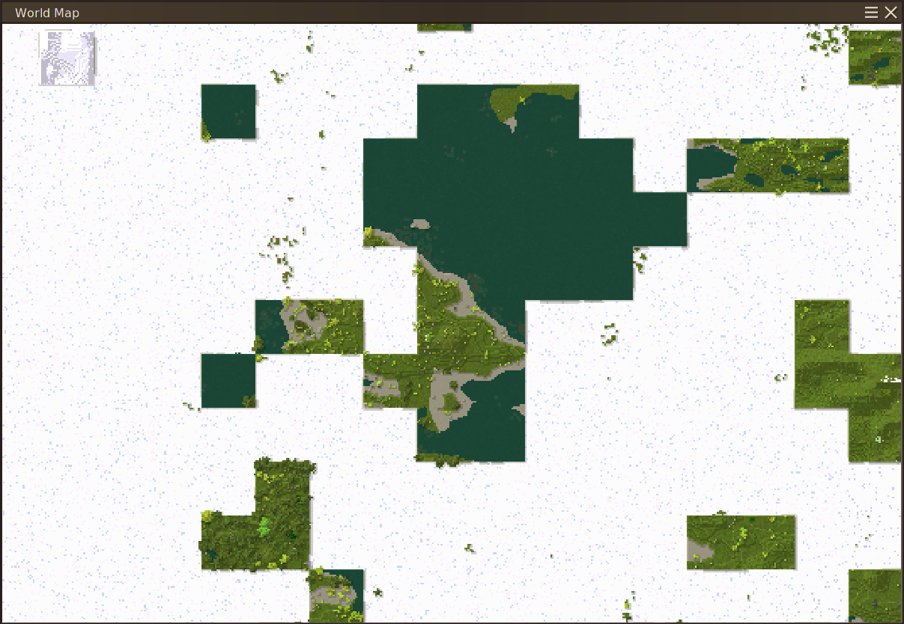

# SkyChunk

.. is a [Vintage Story] mod which removes 85% of chunks from the world to create a unique experience and challenge for the veteran player. No other balance changes are made, so you might have to re-roll your world a couple of times and adjust some world customizing settings to get a working start.

Only applies to newly created worlds, your existing worlds will be untouched.

| Ingame Screenshot | World Map |
| ----------------- | --------- |
|  |  |

This mod idea is ruthlessly stolen from the [Minecraft mod of the same name][MC SkyChunk] made by my good friend [LemmaEOF], requested by its stream viewer *ThatNEET_*, who in turn was inspired by *TapL*'s ["Minecraft, But 99% Of The Chunks Are Removed"][TapL Video] challenge video.

## Download / Installation

Available right here through [GitHub Releases][Downloads].

To install, start the game and go to the Mod Manager in the main menu. There you can find a button labeled Open Mod Folder that will open said folder in your file explorer. Simply copy the `.zip` file you downloaded into here **without extracting it**.

[Vintage Story]: https://vintagestory.at/
[MC SkyChunk]:   https://github.com/Boundarybreaker/Skychunk
[LemmaEOF]:      https://twitter.com/b0undarybreaker
[Tapl Video]:    https://www.youtube.com/watch?v=nZOCHHch140
[workaround]:    https://github.com/copygirl/SkyChunk/blob/master/SkyChunkSystem.cs#L29-L33
[Downloads]:     https://github.com/copygirl/SkyChunk/releases
